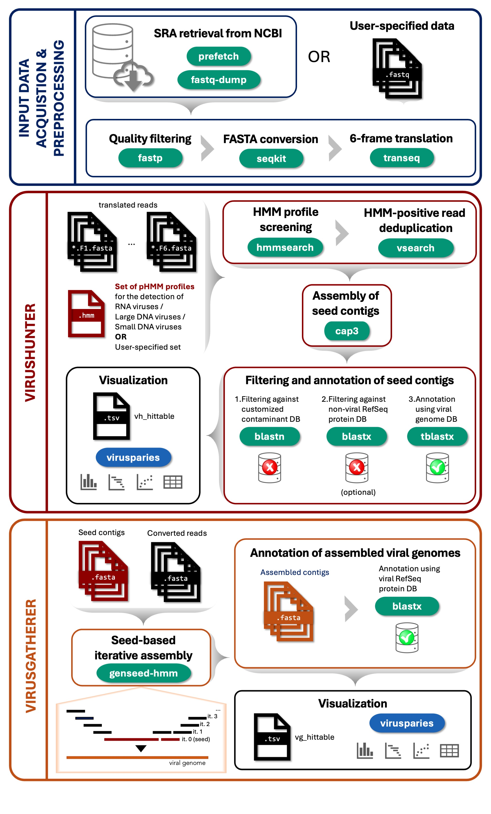

# Summary

This is a two-stage computational workflow for data-driven virus discovery from sequencing data from the [Sequence Read Archive](https://www.ncbi.nlm.nih.gov/sra) or your own data. Stage 1 (**Virushunter**) searches the raw reads using profile Hidden Markov Models. Stage 2 (**Virusgatherer**) perform a seed-based, iterative viral genome assembly that specifically targets the sequences identified in the first stage.

**VirusHunterGatherer** results can be inspected and visualized using the accompanying R package [**Virusparies**](https://github.com/SergejRuff/Virusparies).

# Documentation

* [Software dependencies](#software-dependencies)
* [Installation](#installation)
* [Blast databases](#blast-databases)
* [pHMM profiles for homology search](#phmm-profiles-for-homology-search)
* [Configuration file](#configuration-file)
* [Test run and system requirements](#test-run-and-system-requirements)
* [Output folders and important files](#output-folders-and-important-files)
* [Support](#support)
* [License](#license)
* [References](#references)



## Software dependencies

 * snakemake
 * Perl
 * EMBOSS
 * seqkit
 * fastp
 * NCBI blast
 * NCBI SRA toolkit
 * HMMer
 * vsearch
 * CAP3
 * Bowtie 2 (optional)

## Installation

1. Install the requirements. To ease the process, we recommend building a Conda environment using the provided `vhvg.yaml` file:

**Note:** Make sure Conda is installed beforehand. You can find installation instructions on [the official website](https://docs.conda.io/projects/conda/en/stable/user-guide/getting-started.html).

```{bash}
conda env create --name environment_name --file vhvg.yaml
conda activate environment_name
```

Alternatively, the environment can be created using this command:

```{bash}
conda create --name environment_name -c bioconda blast cap3 emboss fastp hmmer perl seqkit snakemake sra-tools vsearch perl-parallel-forkmanager
conda activate environment_name
```

2. Clone the current repository:

```{bash}
git clone https://github.com/lauberlab/VirusHunterGatherer.git
```

**Note:** Make sure Git is installed on your system. (You can run `conda install git` to have it in the same Conda environment.)

3. Before running the tool, set up the required [Blast databases](#blast-databases) and edit the `config.yaml` [file](#configuration-file).

## Blast databases

During pipeline execution, Virushunter and Virusgatherer rely on several Blast databases to filter and annotate assembled contigs. For general use and initial test runs, we recommend setting up the following databases:

**Note:** In the examples provided here, the `4_databases` folder within this repository is used as the default location for storing database files. You may choose any other location based on your preference.

### Contaminant DB (DBFILTER in `config.yaml`)

A custom set of contaminant sequences is provided and must be indexed prior to use by running:

```{bash}
cd 4_databases/filter/
makeblastdb -in filter.fasta -dbtype nucl -parse_seqids
```

One can use their own custom contamination database. For this,

1. **Create a FASTA file**

   Collect all contaminant sequences into a single file, for example, `my_contaminants.fasta`
   
2. **Place the file in a dedicated directory** (recommended)

   ```
   mkdir 4_databases/my_filter/
   mv my_contaminants.fasta 4_databases/my_filter/
   cd 4_databases/my_filter/
   ```

3. **Build the BLAST database**

   ```
   makeblastdb -in my_contaminants.fasta -dbtype nucl -parse_seqids
   ```

4. **Update the configuration file**

   In your `config.yaml`, set the `DBFILTER` parameter to point to the newly created database (use the path **without file extension**)

   ```yaml
   DBFILTER: "<full_path_to_directory>/VirusHunterGatherer/4_databases/my_filter/my_contaminants"
   ```

### RefSeq protein DB (DBREFSEQ in `config.yaml`)

The database is available from the NCBI Blast FTP repository (https://ftp.ncbi.nlm.nih.gov/blast/db/). For downloading and updating the database, we recommend using the `update_blastdb.pl` utility provided with NCBI Blast:

```{bash}
cd 4_databases/
mkdir refseq_protein; cd refseq_protein/
update_blastdb.pl --decompress refseq_protein
```

**Important**: The full database can exceed 100 GB in size. Even if this filtering step is disabled (by setting "ENABLE_FILTER_3: 0" in `config.yaml`), the database remains required, as Virusgatherer uses it for viral contig annotation. As an alternative, a reduced viral RefSeq protein database can be used:

```
cd 4_databases/
mkdir refseq_protein; cd refseq_protein/
wget https://ftp.ncbi.nlm.nih.gov/refseq/release/viral/viral.1.protein.faa.gz
gunzip viral.1.protein.faa.gz
makeblastdb -in viral.1.protein.faa -dbtype prot -parse_seqids -out viral_refseq_protein
```

### Viral genome DB (DBVIRAL in `config.yaml`)

The database is available from the NCBI Blast FTP repository (https://ftp.ncbi.nlm.nih.gov/refseq/release/viral/). It can be downloaded and set up by running:

```{bash}
cd 4_databases/
mkdir viral_genomic; cd viral_genomic/
wget https://ftp.ncbi.nlm.nih.gov/refseq/release/viral/viral.1.1.genomic.fna.gz
gunzip viral.1.1.genomic.fna.gz
makeblastdb -in filter.fasta -dbtype nucl -parse_seqids -out viral_genomic
```

### Viral RefSeq protein DB (ACCSVIRAL in `config.yaml`)

The database is available from the NCBI Blast FTP repository (https://ftp.ncbi.nlm.nih.gov/refseq/release/viral/). However, only a list of accession identifiers is required for subsequent queries against the RefSeq protein DB created above. This list can be generated using:

```{bash}
cd 4_databases/
mkdir viral_protein; cd viral_protein/
wget https://ftp.ncbi.nlm.nih.gov/refseq/release/viral/viral.1.protein.faa.gz
gunzip viral.1.protein.faa.gz
grep ">" viral.1.protein.faa | cut -d " " -f 1,1 | cut -c 2- > viral_protein.acc_list
```

<!--
NOTE: to download only RdRp-encoding RNA viruses, the following command can be used: `esearch -db nucleotide -query "txid2559587[Organism:exp] AND refseq[filter] NOT txid2732397[Organism:exp]" | efetch -format fasta > riboviria.no_pararnavirae.genomic.fna`
-->

## pHMM profiles for homology search

Virushunter performs homology searches using protein Hidden Markov Model (pHMM) profiles. The package includes three predefined pHMM profile sets located in the `2_profiles` directory:

| Virus group                            | Number of pHMM profiles |
|----------------------------------------|-------------------------|
| RNA viruses                            | 31                      |
| small DNA viruses (typically ~2–10 kb) | 12                      |
| large DNA viruses                      | 88                      |

Further details on these pHMM profiles can be found in the pipeline publication ( :heavy_exclamation_mark: TODO: add citation and link).

To screen sequences against a specific virus group, set the `VIRFAM` parameter in `config.yaml` to the desired group name.

**Using Custom pHMM Profiles**

One can also provide your own set of pHMM profiles. For this,

1. Combine all pHMM profiles for your virus group into a single file (e.g., `myFamily-profile.hmm`).

   **NOTE** The addition `-profile.hmm` is required for the tool to recognise the file.

2. Place this file in the `2_profiles` directory of the repository.
3. Update the `config.yaml` file to reference your custom profile set:
```yaml
VIRFAM: "myFamily"
```

## Configuration file

The provided `config.yaml` serves as an example and is preconfigured for initial test runs, once the paths to the required folders and databases have been updated.

## Test run and system requirements

After setting up the required [BLAST databases](#blast-databases) and updating the [configuration file](#configuration-file), the pipeline can be executed from the repository directory using Snakemake.

Dry run to preview workflow steps:
```{bash}
snakemake -n -p -j 3 --configfile config.yaml
```

Execute the pipeline:
```{bash}
snakemake -p -j 3 --configfile config.yaml
```

#### Example performance (on the test dataset)

The following system was used for the test run:
* **CPU**: AMD Ryzen 3 3300X (4 cores / 8 threads, 3.8 GHz)
* **RAM**: 32 GB

Test results:
* **Peak memory usage**: ~1.4 GB RAM
* **CPU time**: ~5 hours
* **Actual waiting time**: ~1 hour 15 minutes

⚠️ This gives users a rough baseline, but actual **runtime and memory usage depend heavily on input size and system configuration**.

## Output folders and important files

All pipeline outputs are written to the `BASEDIR` directory (user-defined arbitrary name). Within this directory, results are organised by the selected HMM profile set and project ID:

```{bash}
BASEDIR/
└── VIRFAM/
    └── PROJECTID/
        ├── hittables/
        ├── logs/
        └── results/
```

* `VIRFAM/` folder indicates the set of HMM profiles used for screening. For example, `RNAviruses` would correspond to a collection of RdRp-derived HMM profiles targeting different RNA virus groups.
* `PROJECTID/` - A unique directory for each analysed dataset (user-defined arbitrary name).

**Main output folders**

* `hittables/` contains tab-separated (`.tsv`) summary tables of detected hits separate for Virushunter and Virusgatherer. These are the primary files for quickly inspecting and interpreting screening results.
* `logs/` stores log files generated during pipeline execution. Useful for troubleshooting and tracking processing steps.
* `results/` contains detailed outputs organized per input FASTQ file:

```{bash}
results/
└── fastq_1/
    ├── virushunter/
    └── virusgatherer/
        └── *.fasta
└── fastq_2/
    ...
```

Each subfolder corresponds to an analyzed FASTQ dataset. Within these, FASTA files containing assembled viral contigs are stored.

**Key files to inspect**
* **Hit tables** (`hittables/*.tsv`)
* **FASTA files** (`results/*/virusgatherer/*.fasta`)

These two outputs together provide both a high-level overview and sequence-level results.

For downstream analysis, we provide **Virusparies**, an R package designed to work with Virushunter and Virusgatherer outputs. It includes tools for filtering and processing hits, computing summary statistics, and generating tables and figures. The package is freely available on [GitHub](https://github.com/SergejRuff/Virusparies), along with a detailed tutorial and documentation.

## Support

For questions or support, email chris.lauber *at* twincore.de

## License

[GPLv3](https://www.gnu.org/licenses/gpl-3.0.en.html)

## References

Neuman BW*, Smart A*, Gilmer O*, Smyth RP*, Vaas J, Böker N, Samborskiy DV, Bartenschlager R, Seitz S, Gorbalenya AE, Caliskan N, Lauber C. Giant RNA genomes: Roles of host, translation elongation, genome architecture, and proteome in nidoviruses. Proc Natl Acad Sci U S A. 2025 Feb 18;122(7):e2413675122. [doi: 10.1073/pnas.2413675122](https://www.pnas.org/doi/10.1073/pnas.2413675122)
 
 * **GenBank TPA accessions**: BK070317-BK070395
 * More data and information about the paper can be found [here](https://github.com/lauberlab/invertebrate_nidovirus_discovery_paper).

Lauber C*, Zhang X*, Vaas J, Klingler F, Mutz P, Dubin A, Pietschmann T, Roth O, Neuman BW, Gorbalenya AE, Bartenschlager R, Seitz S. Deep mining of the Sequence Read Archive reveals major genetic innovations in coronaviruses and other nidoviruses of aquatic vertebrates. PLoS Pathog. 2024 Apr 22;20(4):e1012163. [doi: 10.1371/journal.ppat.1012163](https://journals.plos.org/plospathogens/article?id=10.1371/journal.ppat.1012163)

 * **GenBank TPA accessions**: BK070274-BK070316

Lauber C, Chong LC. Viroid-like RNA-dependent RNA polymerase-encoding ambiviruses are abundant in complex fungi. *Frontiers Microbiology*. 2023 May 12; Volume 14. [https://doi.org/10.3389/fmicb.2023.1144003](https://doi.org/10.3389/fmicb.2023.1144003)

Lauber C*, Seitz S*, Mattei S, Suh A, Beck J, Herstein J, Börold J, Salzburger W, Kaderali L, Briggs JAG, Bartenschlager R. Deciphering the Origin and Evolution of Hepatitis B Viruses by Means of a Family of Non-enveloped Fish Viruses. *Cell Host Microbe*. 2017 Sep 13;22(3):387-399.e6. [doi: 10.1016/j.chom.2017.07.019](https://pubmed.ncbi.nlm.nih.gov/28867387/).

\* equal contribution
